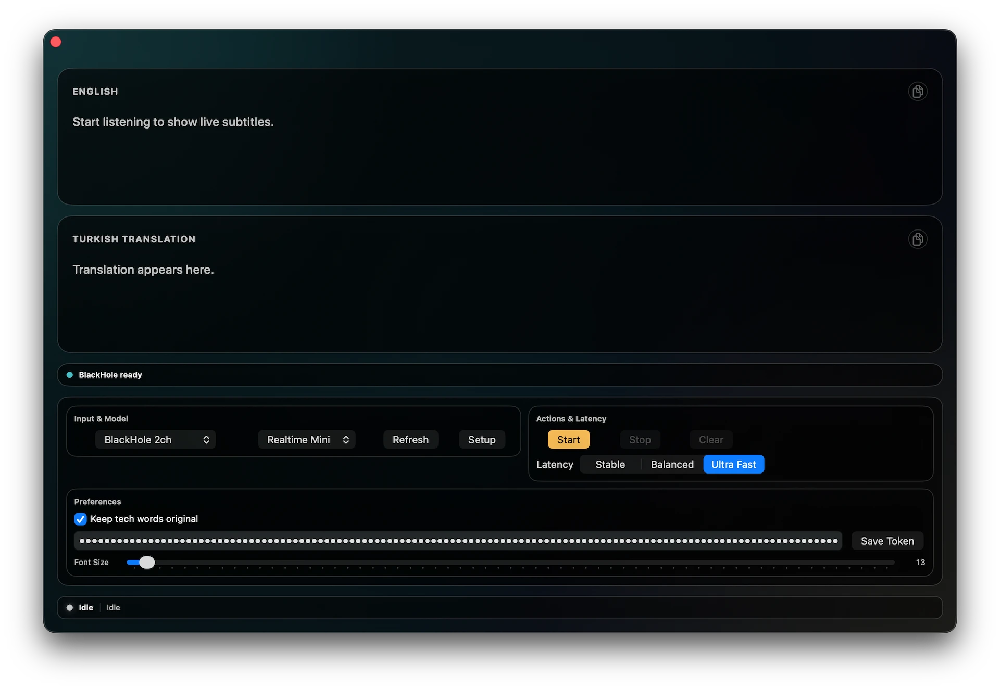

# RealTimeCaptionsTranslator

Minimal macOS 14+ SwiftUI app for real-time English subtitles and Turkish translation from system audio input (e.g. BlackHole) via OpenAI Realtime WebRTC.

## Preview

- Demo video (MP4): [screenshots/app-video.mp4](screenshots/app-video.mp4)

## Stack
- Swift
- SwiftUI
- AVFoundation
- CoreAudio
- OpenAI Realtime (WebRTC)

## Run (Xcode)
Run the app from Xcode.

### Xcode (Recommended)
- Open `RealTimeCaptionsTranslator.xcodeproj` in Xcode
- Run the `RealTimeCaptionsTranslator` app target/scheme
- Make sure the app target uses `App/Info.plist`

## Notes
- Install and route audio through BlackHole (or another virtual input device).
- Select that input device in the app.
- In-app BlackHole Setup Guide:
  - Use `Setup` in the Input section or `Open Setup` in the warning banner.
  - Follow guided steps for install, routing, refresh, and selection.
  - Installer execution is not automated; user confirmation is required by macOS.
- Hybrid realtime flow:
  - English captions come from `input_audio_transcription` events.
  - While speaking, app sends debounced live partial translation requests.
  - For each English final segment, app sends a final `response.create` request for Turkish.
  - Turkish panel is updated from `response.output_text.delta/done`.
- `Keep tech words original` controls per-segment translation instructions.
- `Latency` preset controls speed/quality:
  - `Stable`: final-oriented translation, higher stability and higher latency.
  - `Balanced` (default): hybrid live + final translation.
  - `Ultra Fast`: most aggressive live translation with lowest latency.
- Settings are persisted locally and restored on next launch:
  - input device
  - model
  - latency preset
  - keep-tech toggle
  - subtitle font size
- API token
- API token is entered from the app UI (Preferences section) and stored in macOS Keychain.
- UI style: cinematic teal/amber overlay with a compact responsive toolbar and dedicated status strip.
- Supported models:
  - `gpt-realtime-mini` (default, lower latency)
  - `gpt-realtime`
- Model can be switched from the app UI.
- On model switch, app sends an OpenAI model access test request and shows popup status (success/failure).
- API token security note: token is stored client-side in macOS Keychain for convenience; prefer rotating regularly.

## Permissions (Important for BlackHole/System Audio)
- Even when capturing system audio through BlackHole (or another virtual device), macOS treats it as audio input capture and requires `Microphone` permission.
- If permission is denied or the prompt does not appear, check `System Settings > Privacy & Security > Microphone`.

## Required Privacy Keys (Xcode App Target)
Preconfigured at:
- `App/Info.plist`

When you create/use a macOS App target in Xcode, set:
- `Info.plist File` -> `App/Info.plist`

## Acknowledgements
- Thanks to the BlackHole project for virtual audio routing on macOS.

## License
MIT. See `LICENSE`.
